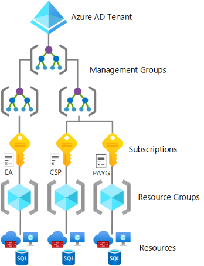
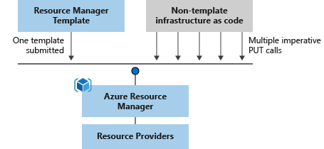

# Концепция k-)
__k-)__ или __k1C__ - контейнеры 1С. Инструмент  для управление инфраструктурой 1С:Предприятие.

## Цели
Целью настоящего проекта является создание инструмента для управленя инфраструктурой 1С:Предприятие, который предназначен для больших организаций с холдинговой структурой, имеющих большое количество информационных баз.

## Основные идеи
В настоящее время, одной из наиболее распространенных концепций для создания, эксплуатации и обслуживания информационных систем является концепция облачных вычислений, поэтому настоящий проект основан на данной концепции.

В качестве образца используется облачная платформа [Microsoft Azure](https://azure.microsoft.com/), поскольку она прекрасно документирована и является одним из лидеров рынка облачных вычислений. 

k1c никоим образом не является клоном или полным аналогом Azure, а всего лишь заимствует и реализует некоторое малое подмножество функционала, имеющегося в Azure.

Поскольку экосистема 1С:Предприятие активно развивается, добавляются программные продукты, непосредственно не связанные с платформой (1С:Исполнитель, 1С:Шина и т.п.), система должна быть открытой и обеспечивать выполнение различных нагрузок.

В качестве платформы, для предоставления вычислительных мощностей используется Podman.

Ввиду востребованности в больших организациях изоляции доступа к различным частям информационных систем для различных групп пользователей, система должна обеспечивать поддержку multitenacy.

Для обеспечения возможности модификации, а также упрощения прохождения аудита безопасности, система должна быть с открытым исходным кодом.

Для снижения порога входа, функционал системы должен быть как можно более близким к образцу.

Поскольку инструмент в первую очередь ориентирован на управление инфраструктурой 1С:Предприятие, в качестве основного языка программирования для реализации выбран встроенный язык 1С:Предприятие.

Далее, если не указано иное, сущности и понятия Azure справедливы и и имеют аналоги в k1c (Azure->k1c). 

## Организация Azure
__Организация (Tenant)__ - это бизнес-сущность, которая использует облачные предложения Майкрософт, которые обычно определяются одним или несколькими доменными именами системы доменных имен (DNS), такими как contoso.com. Организация — это контейнер для подписок. Также, организация - это выделенный экземпляр Azure Entra ID, который используется для проверки подлинности пользователей и авторизации.

Организация создается автоматически при регистрации в Azure.

Элементы иерархии организации Azure представлены на рисунке ниже:

__Группа управления (Management Group)__ - это контейнеры, которые помогают управлять доступом, политикой и соответствием требованиям в нескольких подписках.

__Подписка (Subscription)__ - это соглашение с корпорацией Майкрософт на использование одной или нескольких облачных платформ или служб Майкрософт, за которые взимается плата (по лицензиям отдельных пользователей или по использованию облачных ресурсов). [Подписка — это единица управления, выставления счетов и масштабирования в Azure](https://learn.microsoft.com/ru-ru/azure/cloud-adoption-framework/ready/landing-zone/design-area/resource-org-subscriptions). 

- Подписки служат границами для назначений Политика Azure.  
Например, для обеспечения соответствия требованиям обычно требуются безопасные рабочие нагрузки, такие как индустрия карт оплаты (PCI). Вместо использования группы управления для сортировки рабочих нагрузок, требующих соответствия PCI, можно добиться такой же изоляции с подпиской, не имея слишком много групп управления с несколькими подписками.  
Если необходимо объединить множество подписок одного и того же архетипа рабочей нагрузки, создайте их в группе управления.

- Подписки служат единицей масштабирования, чтобы рабочие нагрузки компонентов могли масштабироваться в пределах ограничений подписки платформы. Убедитесь, что вы считаете ограничения ресурсов подписки при разработке рабочих нагрузок.

- Подписки предоставляют границу управления для управления и изоляции, которая четко разделяет проблемы.

- Создайте отдельные подписки платформы для управления (мониторинга), подключения и удостоверения при необходимости.

- Использование ручных процессов для ограничения клиентов Microsoft Entra только Соглашение Enterprise подписок на регистрацию. При использовании ручного процесса нельзя создавать подписки Microsoft Developer Network (MSDN) в корневой группе управления область.

Фактически - это активный договор.

__Группа ресурсов (Resource Group)__ — контейнер, содержащий связанные ресурсы для решений Azure. Группа ресурсов содержит ресурсы, которыми вы хотите управлять как группой. Решение о том, что должно входить в группу ресурсов, принимается исходя из нужд организации. См. раздел " [Что такое группа ресурсов?](https://learn.microsoft.com/en-us/azure/azure-resource-manager/management/overview#resource-groups)".

__Ресурс (Resource)__ — управляемый элемент, доступный в Azure. Информационные базы 1С:Предприятие, виртуальные машины, учетные записи хранения, веб-приложения, базы данных и виртуальные сети являются примерами ресурсов. Примеры ресурсов: группы ресурсов, подписки, группы управления и теги.

__Ресурс расширения (Extension Resource)__ — ресурс , добавляющий к возможностям другого ресурса. Например, назначение роли — это ресурс расширения. Назначение роли применяется к любому другому ресурсу, чтобы указать доступ. См. статью "[Ресурсы расширения](https://learn.microsoft.com/en-us/azure/azure-resource-manager/management/extension-resource-types)".

## Схема работы с системой
__Поставщик ресурсов__ — служба, которая предоставляет ресурсы Azure. Например, распространенный поставщик ресурсов — это `Microsoft.Compute`, который предоставляет ресурс виртуальной машины. `Microsoft.Storage` является еще одним распространенным поставщиком ресурсов. См. [дополнительные сведения о поставщиках и типах ресурсов](https://learn.microsoft.com/en-us/azure/azure-resource-manager/management/resource-providers-and-types).

__Декларативный синтаксис__ позволяет описать объект, который вы собираетесь создать, не используя напрямую последовательность команд создания. В качестве примеров декларативного синтаксиса можно назвать шаблоны ARM и файлы Bicep. В таких файлах вы указываете свойства для инфраструктуры, развертываемой в Azure.

__Шаблон ARM__ — это файл в формате JSON (нотация объектов JavaScript), который определяет один или несколько ресурсов для развертывания в группе ресурсов, подписке, группе управления или арендаторе. Шаблон можно использовать для согласованного и многократного развертывания ресурсов. См. общие сведения о развертывании шаблона.

Схема работы с системой, аналогична схеме работы с облачной платформой Azure, которая представлена на рисунке ниже:  

> __Важно!__  
> Реализация клиентского доступа ограничена (по крайней мере пока) web-порталом.

Управление облачными ресурсами производится при помощи компонентов клиентского доступа (Azure portal, Azure PowerShell, Azure CLI, REST clients), которые  обращаются к службе управления ресурсами ([Azure Resource Manager](https://learn.microsoft.com/en-us/azure/azure-resource-manager/management/overview)), которая в свою очередь и осуществляет управление облачными ресурсами. 

Менеджер ресурсов управляет ресурсами не напрямую, а при помощи соответствующих поставщиков ресурсов. Такой подход позволяет достаточно гибко динамически изменять набор используемых типов ресурсов.

Описание целевой инфраструктупы производится в декларативном стиле, при помощи [шаблонов ARM](https://learn.microsoft.com/en-us/azure/azure-resource-manager/templates/overview).

Схема процесса развертывания представлена на рисунке ниже:

> __Важно!__  
> В отличие от Azure, реализация функций развертывания без шаблонов (по крайней мере пока) не планируется.

## Обеспечение высокой доступности
Высокая доступность облачных сервисов Azure обеспечивается географическим рспределением вычислительных мощностей по [регионам Azure](https://azure.microsoft.com/ru-ru/explore/global-infrastructure), а также их распределением по [зонам доступности](https://learn.microsoft.com/en-us/azure/reliability/availability-zones-overview?tabs=azure-cli) внутри региона. 

__Регион Azure__ — это набор центров обработки данных, развернутых в пределах периметра, определяемого задержкой, и соединенных между собой выделенной региональной сетью с малой задержкой.

Высокая доступность сервисов в k1c обеспечивается аналогичным образом. Фактически, поставщики ресурсов могут быть развернуты в нескольких расположениях (регионах), а оборудование, котоым они управляют разделяется на зоны доступности. Также как и в Azure, поддерживается три зоны доступности. 

## Выполнение рабочих нагрузок
Microsoft Azure предлагает несколько возможных [вариантов сервисов](https://learn.microsoft.com/en-us/azure/container-apps/compare-options) для развертывания и выполнения рабочих нагрузок в контейнерах.

В k1c, выполнение рабочих нагрузок (кластеры 1С:Предприятие, серверы СУБД, web-серверы) производится с использованием сервиса, аналогичного [Azure Container Instances](https://learn.microsoft.com/ru-ru/azure/container-instances/) (Экземпляры контейнеров), ключевой элемент которого - [группа контейнеров](https://learn.microsoft.com/ru-ru/azure/container-instances/container-instances-container-groups).

Фактически в Azure - это виртуальная машина под управлением Linux, на которой развернут Docker, в котором в свою очередь выполняется один или более контейнеров. В отличие от Microsoft Azure, в k1c, в качестве платформы контейнеризации используется Podman, который обеспечивает лучшую работу в rootless режиме.

> __Важно!__  
> В отличие от Microsoft Azure, в целях повышения производительности, изоляция уровня виртуальной машины не используется и рабочие нагрузки выполняются непосредственно на физическом оборудовании. Изоляция ресурсов осуществляется запуском контейнеров от имени различных пользователей.

Высокая доступность сервисов выполнения рабочих нагрузок в k1c обеспечивается аналогично сервису Azure Container Instances. Фактически, высокая доступность обеспечивается средствами выполняемых приложений (кластер 1С:Предприятие, кластер PostgreSQL и т.п.), а также дублированием групп контейнеров с размещением их в различных зонах доступности.  

Схема размещения сервиса Экземпляры контейнеров в регионе представлена на рисунке ниже:

Более подробно, концепция реализации поставщика Экземпляры контейнеров и связанных с ним ресурсов описано [здесь]().

## Архитектура k1c
Схема компонентов представлена на рисунке ниже:

- Портал и менеджер ресурсов совмещены в одну конфигурацию

- Для повышения безопасности, портал каждой организации представляет собой отдельную информационную базу 1С:Предприятие.

- Поставщики ресурсов - отдельные информационные базы 1С:Предприятие. Возможно, что одна информационная база реализует несколько поставщиков ресурсов.

- Взаимодействие между информационными базами осуществляется посредством http сервисов c использованием REST.

- Клиенты и порталы используют взаимную проверку подлинности на основе сертификатов.