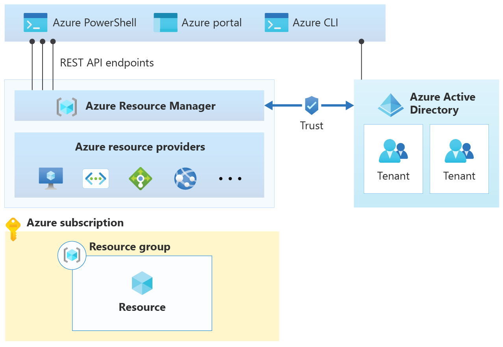

# Архитектура облачной платформы Microsoft Azure

## Логическая Архитектура

[источник](https://learn.microsoft.com/en-us/azure/cloud-adoption-framework/get-started/how-azure-resource-manager-works)

Основные компоненты облачной платформы Azure представлены на рисунке ниже:

### Ресурсы Azure

В Azure ресурс — это сущность, управляемая Azure. Виртуальные машины, виртуальные сети и учетные записи хранения являются примерами ресурсов Azure.

### Что такое группа ресурсов Azure?
Каждый ресурс в Azure должен принадлежать группе ресурсов. Группа ресурсов — это логический контейнер, который связывает несколько ресурсов, чтобы управлять ими в виде одной сущности на основе жизненного цикла и безопасности. Например, можно создать или удалить ресурсы в виде группы, если ресурсы имеют одинаковый жизненный цикл, например ресурсы для n-уровневого приложения. Другими словами, все, что вы создаете, управляете и удаляете вместе, связано в группе ресурсов.

### Подписка Azure
Подписка Azure похожа на группу ресурсов в том, что это логический контейнер, который связывает группы ресурсов и соответствующие ресурсы. Тем не менее подписка Azure также связана с элементами управления, используемыми Azure Resource Manager.

[Подписка](https://learn.microsoft.com/en-us/microsoft-365/enterprise/subscriptions-licenses-accounts-and-tenants-for-microsoft-cloud-offerings?view=o365-worldwide#subscriptions) — это соглашение с корпорацией Майкрософт на использование одной или нескольких облачных платформ или служб Майкрософт, за которые взимается плата (по лицензиям отдельных пользователей или по использованию облачных ресурсов).

### Azure Resource Manager
Служба для управления ресурсами Azure. Управление облачными ресурсами производится при помощи компонентов клиентского доступа (Azure portal, Azure PowerShell, Azure CLI, REST clients), которые обращаются к службе управления ресурсами (Azure Resource Manager) при помощи REST API, которая в свою очередь и осуществляет управление облачными ресурсами.

Менеджер ресурсов осуществляет управление ресурсами не напрямую, а при помощи провайдеров ресурсов.

На следующей схеме показаны вычислительные, сетевые ресурсы и ресурсы хранения, развернутые с помощью Resource Manager.

SRP: Провайдер ресурсов хранилища (Storage Resource Provider), CRP: Провайдер ресурсов вычислений (Compute Resource Provider), NRP: Провайдер сетевых ресурсов (Network Resource Provider).

### Обработка запросов в Azure Resource Manager

Сначала проверяется, что запрос выполняет проверенный пользователь. Для этого, Resource Manager должен иметь доверительные отношения с Microsoft Entra ID (Azure Active Directory) для предоставления функциональности.

В AAD можно сегментировать пользователей по организациям (Tenant). Tenant - это логическая конструкция, представляющая безопасный выделенный экземпляр AAD (MS Entra ID).

Также, подписка должна быть связана с организацией.

Следующим проверяется, имеет ли пользователь необходимые права на выполнение запроса. Разрешения присваиваются пользователям с помощью механизма [управления доступом на основе ролей (RBAC)](https://learn.microsoft.com/ru-ru/azure/role-based-access-control/).

На следующем этапе проверяется, разрешен ли запрос согласно параметрам, заданным в [политике ресурсов Azure](https://learn.microsoft.com/ru-ru/azure/governance/policy/). Политики ресурсов Azure указывают операции, разрешенные в конкретном ресурсе. Например, в соответствии с политикой ресурсов Azure пользователи смогут развертывать только определенные типы виртуальной машины.

На следующем этапе проверяется, не превышает ли запрос [ограничения подписки Azure](https://learn.microsoft.com/ru-ru/azure/azure-resource-manager/management/azure-subscription-service-limits). Например, каждая подписка может максимально содержать 980 групп ресурсов.

В последнюю очередь проверяется, остается ли запрос в рамках финансовых обязательств, которые вы связываете с подпиской. Например, если отправляется запрос на развертывание виртуальной машины, Azure Resource Manager проверяет платежную информацию в подписке.

### Организация Azure

Tenant - это логическая конструкция, представляющая безопасный выделенный экземпляр AAD (MS Entra ID).

Иерархия организации представлена на рисунке ниже:

[Организация](https://learn.microsoft.com/en-us/microsoft-365/enterprise/subscriptions-licenses-accounts-and-tenants-for-microsoft-cloud-offerings?view=o365-worldwide#organization) представляет собой бизнес-сущность, которая использует облачные предложения Майкрософт, которые обычно определяются одним или несколькими доменными именами системы доменных имен (DNS), такими как contoso.com. Организация — это контейнер для подписок.

## Ссылки
[Subscriptions, licenses, accounts, and tenants for Microsoft's cloud offerings](https://learn.microsoft.com/en-us/microsoft-365/enterprise/subscriptions-licenses-accounts-and-tenants-for-microsoft-cloud-offerings?view=o365-worldwide)

[Resource access management in Azure](https://learn.microsoft.com/en-us/azure/cloud-adoption-framework/get-started/how-azure-resource-manager-works#what-is-an-azure-resource-group)