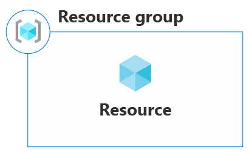
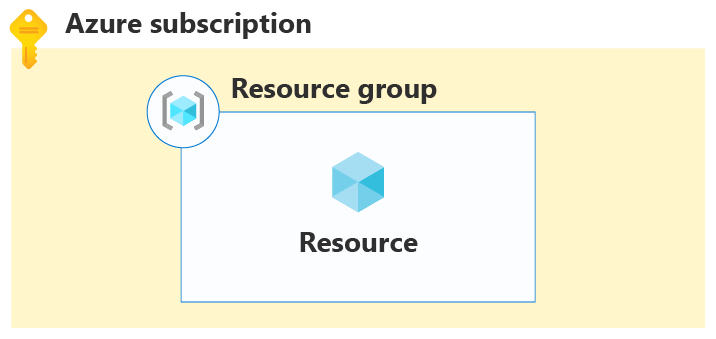

# Архитектура облачной платформы Microsoft Azure

## Логическая Архитектура

[источник](https://learn.microsoft.com/en-us/azure/cloud-adoption-framework/get-started/how-azure-resource-manager-works)

Основные компоненты облачной платформы Azure представлены на рисунке ниже (см. ):

### Ресурсы Azure

В Azure ресурс — это сущность, управляемая Azure. Виртуальные машины, виртуальные сети и учетные записи хранения являются примерами ресурсов Azure.

### Что такое группа ресурсов Azure?
Каждый ресурс в Azure должен принадлежать группе ресурсов. Группа ресурсов — это логический контейнер, который связывает несколько ресурсов, чтобы управлять ими в виде одной сущности на основе жизненного цикла и безопасности. Например, можно создать или удалить ресурсы в виде группы, если ресурсы имеют одинаковый жизненный цикл, например ресурсы для n-уровневого приложения. Другими словами, все, что вы создаете, управляете и удаляете вместе, связано в группе ресурсов.

### Подписка Azure
Подписка Azure похожа на группу ресурсов в том, что это логический контейнер, который связывает группы ресурсов и соответствующие ресурсы. Тем не менее подписка Azure также связана с элементами управления, используемыми Azure Resource Manager.

### Azure Resource Manager
Служба для управления ресурсами Azure. Управление облачными ресурсами производится при помощи компонентов клиентского доступа (Azure portal, Azure PowerShell, Azure CLI, REST clients), которые обращаются к службе управления ресурсами (Azure Resource Manager) при помощи REST API, которая в свою очередь и осуществляет управление облачными ресурсами.

Менеджер ресурсов осуществляет управление ресурсами не напрямую, а при помощи провайдеров ресурсов.

На следующей схеме показаны вычислительные, сетевые ресурсы и ресурсы хранения, развернутые с помощью Resource Manager.

SRP: Провайдер ресурсов хранилища (Storage Resource Provider), CRP: Провайдер ресурсов вычислений (Compute Resource Provider), NRP: Провайдер сетевых ресурсов (Network Resource Provider).

